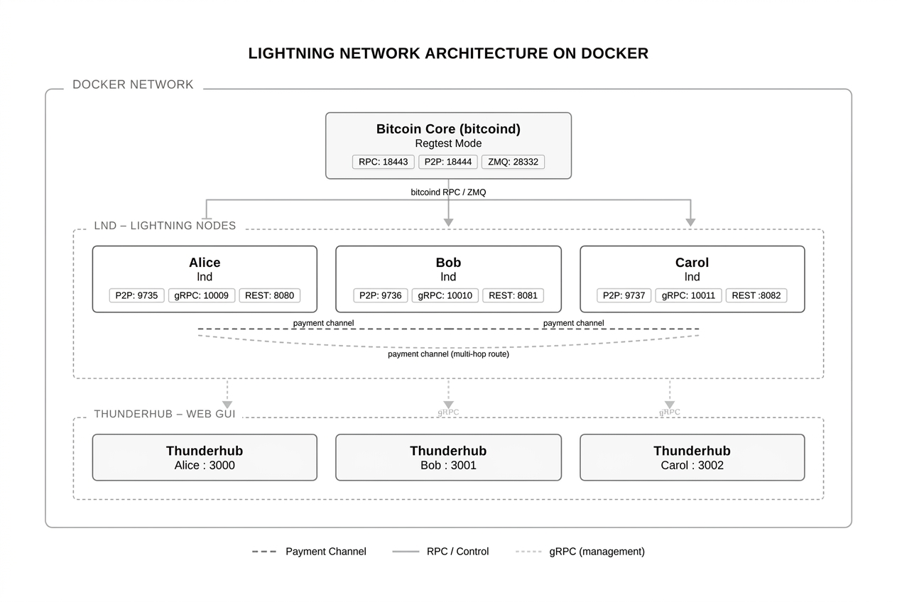

# Lightning Network Research Environment

A self-contained Docker-based testbed for studying Bitcoin Lightning Network internals — including multi-hop payment routing, watchtower mechanics, and channel breach / justice transaction behavior.

All activity runs on **Bitcoin regtest** (no real funds, no real network).

---

## Overview

This environment spins up:

| Container | Role |
|-----------|------|
| `bitcoin-research` | Bitcoin Core in regtest mode |
| `lnd-alice` | LND node A — also hosts the **Watchtower Server** |
| `lnd-bob` | LND node B — honest party, protected by Alice's watchtower |
| `lnd-carol` | LND node C — acts as the "cheater" in breach simulations |
| `thunderhub` | Web UI for exploring channel state across all three nodes |

**Channel topology:**



---

## Prerequisites

- [Docker](https://docs.docker.com/get-docker/) with the Compose plugin
- `jq` (for the helper scripts)
- Bash for Linux/macOS workflow
- PowerShell 7+ (`pwsh`) for Windows workflow

---

## Quick Start

### 1. Start the stack

```bash
docker compose up -d
```

### 2. Grant execute permissions (Linux/macOS only)

```bash
chmod +x scripts/linux/*.sh
```

### 3. Initialize wallets (one-time, first run only)

Linux/macOS:

```bash
bash scripts/linux/00-setup-gui.sh
```

Windows PowerShell:

```powershell
pwsh scripts/windows/00-setup-gui.ps1
```

Follow the prompts to create or unlock the LND wallets for Alice, Bob, and Carol.

### 4. Run the setup scripts in order

Linux/macOS:

```bash
bash scripts/linux/01-fund-nodes.sh       # Mine blocks & fund nodes with regtest BTC
bash scripts/linux/02-connect-peers.sh    # Connect peers and open channels
bash scripts/linux/03-payment-routing.sh  # Send multi-hop payments Alice -> Bob -> Carol
bash scripts/linux/04-watchtower.sh       # Register Bob & Carol with Alice's watchtower
bash scripts/linux/05-channel-states.sh   # Inspect commitment tx and channel state
```

Windows PowerShell:

```powershell
pwsh scripts/windows/01-fund-nodes.ps1
pwsh scripts/windows/02-connect-peers.ps1
pwsh scripts/windows/03-payment-routing.ps1 -Amount 50000
pwsh scripts/windows/04-watchtower.ps1
pwsh scripts/windows/05-channel-states.ps1
```

### 5. Run the breach simulation

Linux/macOS:

```bash
bash scripts/linux/07-breach-simulation.sh
```

Windows PowerShell:

```powershell
pwsh scripts/windows/07-breach-simulation.ps1
```

Or follow the step-by-step walkthrough in [results/LightningNetworkChannelBreachSimulation.md](results/LightningNetworkChannelBreachSimulation.md).

---

## Helper Aliases

Linux/macOS: source the Bash helpers to get shortcut commands for each node:

```bash
source scripts/linux/helpers.sh
```

Windows PowerShell: dot-source the PowerShell helpers:

```powershell
. ./scripts/windows/helpers.ps1
```

Then interact with nodes directly:

```bash
alice getinfo
bob   listchannels
carol addinvoice --amt 1000
mine 6                        # mine 6 regtest blocks
btc  getblockchaininfo        # raw bitcoin-cli call
```

---

## ThunderHub Web UI

Three separate ThunderHub instances are running, one per node. Open them in a browser after starting the stack:

| Node | URL |
|------|-----|
| Alice | http://localhost:3000 |
| Bob | http://localhost:3001 |
| Carol | http://localhost:3002 |

**Password:** `research_thub_password` (same for all three)

ThunderHub lets you browse channel state, pending HTLCs, on-chain balances, and routing history without the command line.

---

## Channel Breach Simulation

The primary research scenario demonstrates the full fraud-prevention lifecycle:

| Phase | What Happens |
|-------|--------------|
| **0** | Pre-flight: verify nodes online, confirm watchtower registration |
| **1** | Force-close Bob↔Carol channel — capture the current commitment tx |
| **2** | Evict that tx from the mempool (it stays unconfirmed) |
| **3** | Reopen channel, make payments → the captured tx is now **revoked** |
| **4** | Broadcast the revoked tx → this is the **breach** (Carol cheating) |
| **5** | Mine blocks → Alice's watchtower fires a **justice transaction** → Carol loses all channel funds to Bob |

This illustrates:

1. How commitment transactions encode channel state
2. How revocation keys invalidate old states
3. How the watchtower monitors the chain and responds automatically
4. The economic penalty that deters fraud in the Lightning Network protocol

---

## Project Structure

```
.
├── docker-compose.yml          # Service definitions
├── bitcoin/                    # Bitcoin Core Dockerfile & regtest config
├── lnd/                        # LND base Dockerfile & entrypoint
├── lnd-alice/                  # Alice's lnd.conf (watchtower server enabled)
├── lnd-bob/                    # Bob's lnd.conf (watchtower client)
├── lnd-carol/                  # Carol's lnd.conf (watchtower client)
├── thunderhub/                 # ThunderHub web UI configs per node
├── data/                       # Persistent node data (git-ignored)
│   ├── bitcoin/
│   ├── alice/
│   ├── bob/
│   └── carol/
├── scripts/
│   ├── linux/
│   │   ├── helpers.sh              # Bash aliases (alice, bob, carol, btc, mine)
│   │   ├── 00-setup-gui.sh         # Wallet init
│   │   ├── 01-fund-nodes.sh        # Mine & fund
│   │   ├── 02-connect-peers.sh     # Peer connections & channel opens
│   │   ├── 03-payment-routing.sh   # Multi-hop payments
│   │   ├── 04-watchtower.sh        # Watchtower registration
│   │   ├── 05-channel-states.sh    # Channel state inspection
│   │   ├── 06-monitor-logs.sh      # Log monitoring helpers
│   │   └── 07-breach-simulation.sh # Full breach & justice tx demo
│   └── windows/
│       ├── helpers.ps1                 # PowerShell aliases
│       ├── 00-setup-gui.ps1            # Wallet init
│       ├── 01-fund-nodes.ps1           # Mine & fund
│       ├── 02-connect-peers.ps1        # Peer connections & channel opens
│       ├── 03-payment-routing.ps1      # Multi-hop payments
│       ├── 04-watchtower.ps1           # Watchtower registration
│       ├── 05-channel-states.ps1       # Channel state inspection
│       ├── 06-monitor-logs.ps1         # Log monitoring helpers
│       └── 07-breach-simulation.ps1    # Full breach & justice tx demo
└── results/
    └── LightningNetworkChannelBreachSimulation.md  # Detailed walkthrough
```

---

## Exposed Ports

| Port | Service |
|------|---------|
| `18443` | Bitcoin Core RPC (regtest) |
| `18444` | Bitcoin Core P2P (regtest) |
| `28332` | Bitcoin ZMQ rawblock |
| `28333` | Bitcoin ZMQ rawtx |
| `9835` | Alice P2P Lightning |
| `10109` | Alice gRPC |
| `8180` | Alice REST |
| `9911` | Alice Watchtower server |
| `3000` | ThunderHub — Alice |
| `3001` | ThunderHub — Bob |
| `3002` | ThunderHub — Carol |

---

## Notes

- All Bitcoin used is **regtest-only** — no real value.
- Wallet data and chain state are persisted in `data/` and survive container restarts.
- LND version: `v0.20.1-beta` (configurable via `LND_VERSION` env var)
- Bitcoin Core version: `29.3` (configurable via `BITCOIN_VERSION` env var)
